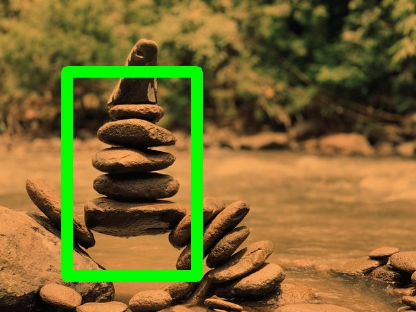
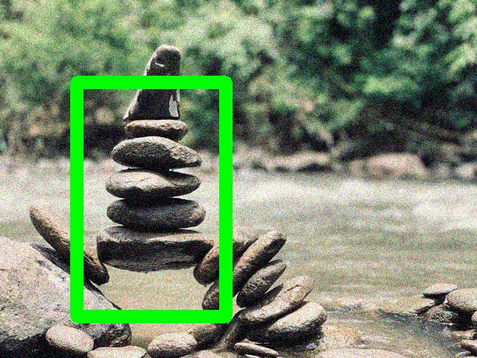
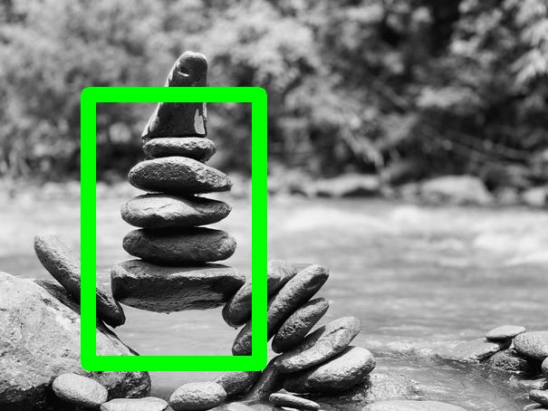
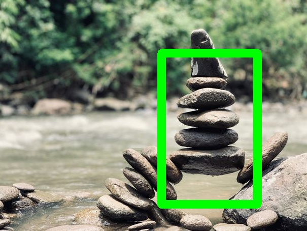
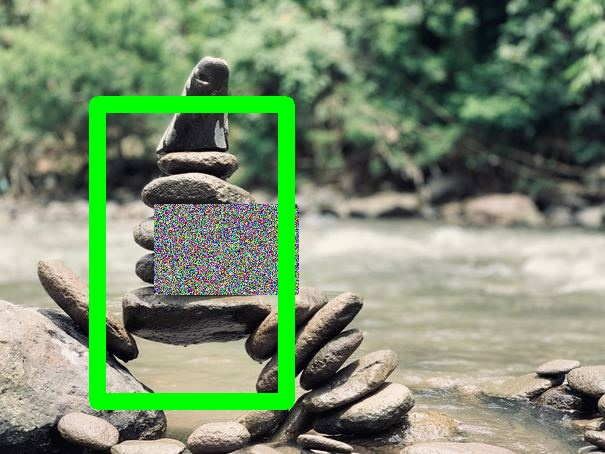
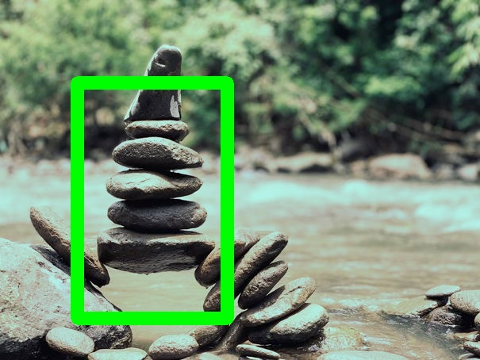
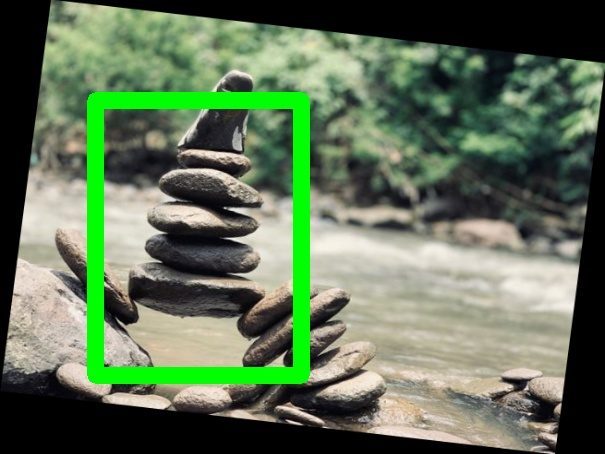
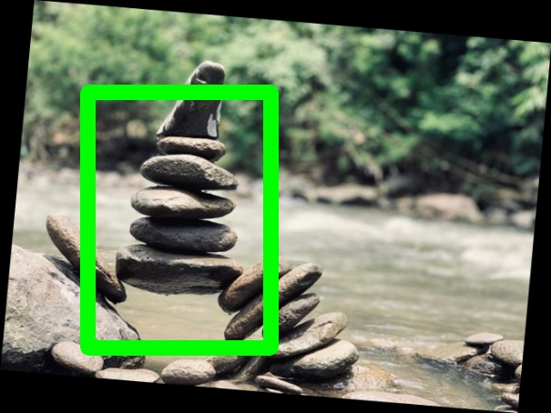

[](https://www.codacy.com/gh/datature/discolight?utm_source=github.com&amp;utm_medium=referral&amp;utm_content=datature/discolight&amp;utm_campaign=Badge_Grade)
[](https://www.codacy.com/gh/datature/discolight?utm_source=github.com&utm_medium=referral&utm_content=datature/discolight&utm_campaign=Badge_Coverage)
# Discolight

Flashy, ravey and state-of-the-art image augmentations to boost the
performance of deep convolutional neural networks

## At a Glance

  - The library works with images in `HxWxC` (channels last) format.
  - Based on numpy, OpenCV, paperspace, imgaug and albumentation.
  - Diversified set of augmentations available.
  - Supports python 3.6-3.8
  - Supports transformations on images, and bounding boxes.
  - The library works with images in `HxWxC` format.
  - This library is maintained by **Datature.io**

## Setup

The easiest way to get started is to install the `discolight` package
via pip:

	$ pip install discolight

Alternatively, if you have cloned this repository, you can run pip on
the contents of the repository folder:

	$ pip install .

## Generating Augmented Images on the Command Line

To augment a set of images with annotations, you must first prepare
your input data and prepare YAML configuration file to describe the
augmentations you want to perform:
```yaml
input:
  images:
        loader: Directory
        options:
          directory: ./sample_images # The base path of where the images are stored

  annotations:
        loader: FourCornersCSV
        options:
          annotations_file: ./sample_images/annotations.csv # The CSV file with annotations
          normalized: true
output:
  images:
        writer: Directory
        options:
          directory: ./output_folder
  annotations:
        writer: FourCornersCSV
        options:
          annotations_file: ./output_folder/aug_annotations.csv
          normalized: true
augmentations:
  - name: GrayScale
        options:
          probs: 0.5
  - name: Rotate
        options:
          probs: 0.7
          angle: 35
  - name: GaussianNoise
        options:
          probs: 0.9
  - name: Shear
        options: {}
save-original: true # Whether to save the original images to the output folder
save-bbox: true # Whether bounding boxes should be drawn on the augmented images
```	
The image and annotation loaders specify how the images and
annotations should be loaded. The `FourCornersCSV` (so-named because
it expects the bounding box to be specified with four coordinates)
loader expects an input CSV file in the following format:
```csv
	image_name,x_min,y_min,x_max,y_max,label
	wheat1.jpg,0,0.799805,0.037109,0.94043,1
	wheat1.jpg,0.064453,0.892578,0.181641,0.949219,1
	...
```
The chosen image loader will be used to load the images specified
under the `image_name` column (for example, `wheat1.jpg`). In this
case, the `Directory` image loader will fetch the images from the
specified folder. For more information on available image and
annotation loaders, see .

Now you can run Discolight:

	$ discolight generate configuration.yml

You can also pass your YAML configuration on standard input:

	$ cat configuration.yml | discolight generate

After generation is complete, the augmented images and annotations
will be written out according to your configuration options. Here, we
choose to save the annotations to a CSV file using the same
four-corners format, and the augmented images will appear in the
`output_folder/` directory.

## Library Functionality

In addition to invoking Discolight from the command line, you can also
invoke it as a library. First, construct the augmentation you want to
apply to an image. For example, here is a simple augmentation
sequence:
```python
from discolight.disco import disco
from discolight.annoations import BoundingBox
from discolight.util.image import load_image, save_image

seq = disco.Sequence(augmentations=[
	disco.GaussianNoise(),
	disco.RandomEraser(),
	disco.Rotate(angle=35)
])
```	
Then, load the image and specify your annotations:
```python
image = load_image("path/to/image.jpg")

annotations = [
	# BoundingBox(x_min, y_min, x_max, y_max, class_idx)
	BoundingBox(0, 819, 38, 963, 1),
	BoundingBox(66, 914, 186, 972, 1),
	BoundingBox(52, 526, 126, 645, 1),
]
```	
Now, you can invoke `seq` as a function to apply your augmentation:
```python
aug_img, aug_annotations = seq(image, annotations)
```
If you have no annotations, you can also apply `seq` only to an image:
```python
aug_img = seq(image)
```
To save the augmented image, use the provided `save_image`
function. You can optionally pass the augmented annotations (also an
array of `BoundingBox` objects) to be drawn in red over the augmented
image:
```python
save_image("aug-with-bboxes.jpg", aug_img, annotations=aug_annotations)
save_image("aug-no-bboxes.jpg", aug_img)
```
If you prefer to perform additional operations on the image after
augmentation, augmented images are OpenCV images in RGB format.

## Supported Augmentations

<table style="width: 100%">

<tr>

<td style="width: 20%">
<b><a href="doc/discolight.md#ColorTemperature">ColorTemperature</a></b>
<br/>
Changes the color temperature of the input image.

The class changes the color temperature to a value
between 1,000 and 40,000 Kelvins (ie. working as a
warming or cooling filter).

This class has largely been adapted from @aleju/imgaug library's
augmenters.ChangeColorTemperature() function. @aleju/imgaug
library can be found at <https://github.com/aleju/imgaug/>
</td>

<td style="vertical-align: bottom">

<br/>
Sample Image
</td>

<td style="vertical-align: bottom">

<br/>
Augmented Image
</td>

<td style="vertical-align: bottom">

<br/>
Sample Image (Bounding Boxes)
</td>

<td style="vertical-align: bottom">

<br/>
Augmented Image (Bounding Boxes)
</td>

</tr>

<tr>

<td style="width: 20%">
<b><a href="doc/discolight.md#GaussianNoise">GaussianNoise</a></b>
<br/>
Add gaussian noise to the given image.
</td>

<td style="vertical-align: bottom">

<br/>
Sample Image
</td>

<td style="vertical-align: bottom">

<br/>
Augmented Image
</td>

<td style="vertical-align: bottom">

<br/>
Sample Image (Bounding Boxes)
</td>

<td style="vertical-align: bottom">

<br/>
Augmented Image (Bounding Boxes)
</td>

</tr>

<tr>

<td style="width: 20%">
<b><a href="doc/discolight.md#GrayScale">GrayScale</a></b>
<br/>
Return a grayscale version of the given image.
</td>

<td style="vertical-align: bottom">

<br/>
Sample Image
</td>

<td style="vertical-align: bottom">

<br/>
Augmented Image
</td>

<td style="vertical-align: bottom">

<br/>
Sample Image (Bounding Boxes)
</td>

<td style="vertical-align: bottom">

<br/>
Augmented Image (Bounding Boxes)
</td>

</tr>

<tr>

<td style="width: 20%">
<b><a href="doc/discolight.md#HorizontalFlip">HorizontalFlip</a></b>
<br/>
Horizontally flips the given image.
</td>

<td style="vertical-align: bottom">

<br/>
Sample Image
</td>

<td style="vertical-align: bottom">

<br/>
Augmented Image
</td>

<td style="vertical-align: bottom">

<br/>
Sample Image (Bounding Boxes)
</td>

<td style="vertical-align: bottom">

<br/>
Augmented Image (Bounding Boxes)
</td>

</tr>

<tr>

<td style="width: 20%">
<b><a href="doc/discolight.md#RandomEraser">RandomEraser</a></b>
<br/>
Randomly erase a rectangular area in the given image.

The erased area is replaced with random noise.
</td>

<td style="vertical-align: bottom">

<br/>
Sample Image
</td>

<td style="vertical-align: bottom">

<br/>
Augmented Image
</td>

<td style="vertical-align: bottom">

<br/>
Sample Image (Bounding Boxes)
</td>

<td style="vertical-align: bottom">

<br/>
Augmented Image (Bounding Boxes)
</td>

</tr>

<tr>

<td style="width: 20%">
<b><a href="doc/discolight.md#RandomHSV">RandomHSV</a></b>
<br/>
Randomly shift the color space of the given image.
</td>

<td style="vertical-align: bottom">

<br/>
Sample Image
</td>

<td style="vertical-align: bottom">

<br/>
Augmented Image
</td>

<td style="vertical-align: bottom">

<br/>
Sample Image (Bounding Boxes)
</td>

<td style="vertical-align: bottom">

<br/>
Augmented Image (Bounding Boxes)
</td>

</tr>

<tr>

<td style="width: 20%">
<b><a href="doc/discolight.md#RandomRotate">RandomRotate</a></b>
<br/>
Randomly rotate the given image.
</td>

<td style="vertical-align: bottom">

<br/>
Sample Image
</td>

<td style="vertical-align: bottom">

<br/>
Augmented Image
</td>

<td style="vertical-align: bottom">

<br/>
Sample Image (Bounding Boxes)
</td>

<td style="vertical-align: bottom">

<br/>
Augmented Image (Bounding Boxes)
</td>

</tr>

<tr>

<td style="width: 20%">
<b><a href="doc/discolight.md#Rotate">Rotate</a></b>
<br/>
Rotate the given image.
</td>

<td style="vertical-align: bottom">

<br/>
Sample Image
</td>

<td style="vertical-align: bottom">

<br/>
Augmented Image
</td>

<td style="vertical-align: bottom">

<br/>
Sample Image (Bounding Boxes)
</td>

<td style="vertical-align: bottom">

<br/>
Augmented Image (Bounding Boxes)
</td>

</tr>

<tr>

<td style="width: 20%">
<b><a href="doc/discolight.md#SaltAndPepperNoise">SaltAndPepperNoise</a></b>
<br/>
Add salt and pepper or RGB noise to the given image.
</td>

<td style="vertical-align: bottom">

<br/>
Sample Image
</td>

<td style="vertical-align: bottom">

<br/>
Augmented Image
</td>

<td style="vertical-align: bottom">

<br/>
Sample Image (Bounding Boxes)
</td>

<td style="vertical-align: bottom">

<br/>
Augmented Image (Bounding Boxes)
</td>

</tr>

<tr>

<td style="width: 20%">
<b><a href="doc/discolight.md#Scale">Scale</a></b>
<br/>
Scale the given image.
</td>

<td style="vertical-align: bottom">

<br/>
Sample Image
</td>

<td style="vertical-align: bottom">

<br/>
Augmented Image
</td>

<td style="vertical-align: bottom">

<br/>
Sample Image (Bounding Boxes)
</td>

<td style="vertical-align: bottom">

<br/>
Augmented Image (Bounding Boxes)
</td>

</tr>

<tr>

<td style="width: 20%">
<b><a href="doc/discolight.md#Sepia">Sepia</a></b>
<br/>
Returns a given image passed through the sepia filter.
</td>

<td style="vertical-align: bottom">

<br/>
Sample Image
</td>

<td style="vertical-align: bottom">

<br/>
Augmented Image
</td>

<td style="vertical-align: bottom">

<br/>
Sample Image (Bounding Boxes)
</td>

<td style="vertical-align: bottom">

<br/>
Augmented Image (Bounding Boxes)
</td>

</tr>

<tr>

<td style="width: 20%">
<b><a href="doc/discolight.md#Sequence">Sequence</a></b>
<br/>
Perform a sequence of augmentations on the given image.
</td>

<td style="vertical-align: bottom">

<br/>
Sample Image
</td>

<td style="vertical-align: bottom">

<br/>
Augmented Image
</td>

<td style="vertical-align: bottom">

<br/>
Sample Image (Bounding Boxes)
</td>

<td style="vertical-align: bottom">

<br/>
Augmented Image (Bounding Boxes)
</td>

</tr>

<tr>

<td style="width: 20%">
<b><a href="doc/discolight.md#Shear">Shear</a></b>
<br/>
Horizontally shear the given image.
</td>

<td style="vertical-align: bottom">

<br/>
Sample Image
</td>

<td style="vertical-align: bottom">

<br/>
Augmented Image
</td>

<td style="vertical-align: bottom">

<br/>
Sample Image (Bounding Boxes)
</td>

<td style="vertical-align: bottom">

<br/>
Augmented Image (Bounding Boxes)
</td>

</tr>

<tr>

<td style="width: 20%">
<b><a href="doc/discolight.md#Translate">Translate</a></b>
<br/>
Translate the given image.
</td>

<td style="vertical-align: bottom">

<br/>
Sample Image
</td>

<td style="vertical-align: bottom">

<br/>
Augmented Image
</td>

<td style="vertical-align: bottom">

<br/>
Sample Image (Bounding Boxes)
</td>

<td style="vertical-align: bottom">

<br/>
Augmented Image (Bounding Boxes)
</td>

</tr>

<tr>

<td style="width: 20%">
<b><a href="doc/discolight.md#VerticalFlip">VerticalFlip</a></b>
<br/>
Vertically flip the given image.
</td>

<td style="vertical-align: bottom">

<br/>
Sample Image
</td>

<td style="vertical-align: bottom">

<br/>
Augmented Image
</td>

<td style="vertical-align: bottom">

<br/>
Sample Image (Bounding Boxes)
</td>

<td style="vertical-align: bottom">

<br/>
Augmented Image (Bounding Boxes)
</td>

</tr>

</table>

## Development

To learn more about how to develop Discolight (e.g., adding additional
augmentatations), see the guide in [doc/develop.md](doc/develop.md).