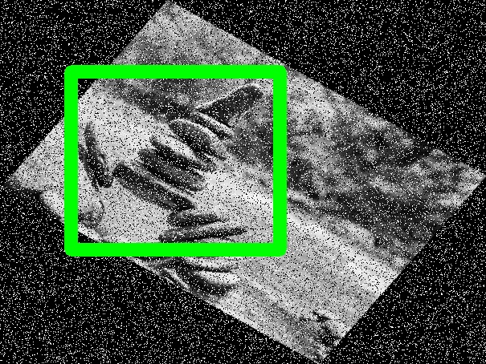
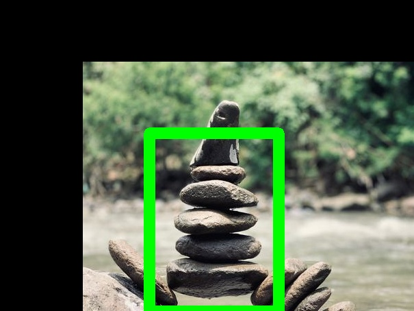
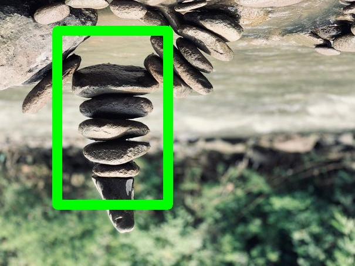

# Annotation Loaders


## FourCornersCSV

Loads annotations from a CSV file in the following format\.

image\_name, x\_min, y\_min, x\_max, y\_max, label

### Parameters


**annotations\_file** *(str)*, required<br/>
The path to the CSV file containing the annotations


**normalized** *(bool)* = True<br/>
whether the bounding box coordinates are stored in a normalized format


## WidthHeightCSV

Loads annotations from a CSV file in the following format\.

image\_name, x\_min, y\_min, width, height, label

### Parameters


**annotations\_file** *(str)*, required<br/>
The path to the CSV file containing the annotations


**normalized** *(bool)* = True<br/>
whether the bounding box coordinates are stored in a normalized format


# Annotation Writers


## FourCornersCSV

Writes annotations to a CSV file in the following format\.

image\_name, x\_min, y\_min, x\_max, y\_max, label

### Parameters


**annotations\_file** *(str)*, required<br/>
The path to the CSV file to write the annotations to


**normalized** *(bool)* = True<br/>
whether the bounding box coordinates should be normalized before saving


## WidthHeightCSV

Writes annotations to a CSV file in the following format\.

image\_name, x\_min, y\_min, width, height, label

### Parameters


**annotations\_file** *(str)*, required<br/>
The path to the CSV file to write the annotations to


**normalized** *(bool)* = True<br/>
whether the bounding box coordinates should be normalized before saving


# Image Loaders


## Directory

Load images from a directory in the filesystem\.

The image name from the AnnotationLoader will be used to fetch a file with
the same name in the given directory\.

### Parameters


**directory** *(str)*, required<br/>
The directory from which to load images


# Image Writers


## Directory

Writes images to a directory in the filesystem\.

Images will be saved to a file with the given name in the given directory\.

### Parameters


**clean\_directory** *(bool)* = True<br/>
whether to forcibly ensure the output directory is empty


**directory** *(str)*, required<br/>
the directory to save images to


# Augmentations


## ColorTemperature

Changes the color temperature of the input image\.

The class changes the color temperature to a value
between 1,000 and 40,000 Kelvins \(ie\. working as a
warming or cooling filter\)\.

This class has largely been adapted from @aleju/imgaug library's
augmenters\.ChangeColorTemperature\(\) function\. @aleju/imgaug
library can be found at <https://github\.com/aleju/imgaug/>

### Example
<table style="width: 100%">
<tr>
<td><b>Input Image</b></td>
<td><b>Augmented Image</b></td>
<td><b>Input Image<br/>(with Bounding Boxes)</b></td>
<td><b>Augmented Image<br/>(with Bounding Boxes)</b></td>
</tr>
<tr>
<td style="vertical-align: bottom">

</td>

<td style="vertical-align: bottom">

</td>

<td style="vertical-align: bottom">

</td>

<td style="vertical-align: bottom">

</td>

</tr>
</table>

### Parameters


**kelvin** *(int in range \[1000, 40000\])* = 3000<br/>
temperature value in to which temperature should be changed


**probs** *(float in range \[0\.0, 1\.0\])* = 1\.0<br/>
The probability that this augmentation will be applied


## GaussianNoise

Add gaussian noise to the given image\.

### Example
<table style="width: 100%">
<tr>
<td><b>Input Image</b></td>
<td><b>Augmented Image</b></td>
<td><b>Input Image<br/>(with Bounding Boxes)</b></td>
<td><b>Augmented Image<br/>(with Bounding Boxes)</b></td>
</tr>
<tr>
<td style="vertical-align: bottom">

</td>

<td style="vertical-align: bottom">

</td>

<td style="vertical-align: bottom">

</td>

<td style="vertical-align: bottom">

</td>

</tr>
</table>

### Parameters


**mean** *(float)* = 0<br/>


**probs** *(float in range \[0\.0, 1\.0\])* = 1\.0<br/>
The probability that this augmentation will be applied


**variance** *(float)* = 0\.01<br/>


## GrayScale

Return a grayscale version of the given image\.

### Example
<table style="width: 100%">
<tr>
<td><b>Input Image</b></td>
<td><b>Augmented Image</b></td>
<td><b>Input Image<br/>(with Bounding Boxes)</b></td>
<td><b>Augmented Image<br/>(with Bounding Boxes)</b></td>
</tr>
<tr>
<td style="vertical-align: bottom">

</td>

<td style="vertical-align: bottom">

</td>

<td style="vertical-align: bottom">

</td>

<td style="vertical-align: bottom">

</td>

</tr>
</table>

### Parameters


**probs** *(float in range \[0\.0, 1\.0\])* = 1\.0<br/>
The probability that this augmentation will be applied


## HorizontalFlip

Horizontally flips the given image\.

### Example
<table style="width: 100%">
<tr>
<td><b>Input Image</b></td>
<td><b>Augmented Image</b></td>
<td><b>Input Image<br/>(with Bounding Boxes)</b></td>
<td><b>Augmented Image<br/>(with Bounding Boxes)</b></td>
</tr>
<tr>
<td style="vertical-align: bottom">

</td>

<td style="vertical-align: bottom">

</td>

<td style="vertical-align: bottom">

</td>

<td style="vertical-align: bottom">

</td>

</tr>
</table>

### Parameters


**probs** *(float in range \[0\.0, 1\.0\])* = 1\.0<br/>
The probability that this augmentation will be applied


## ImageCompression

Image compress the given image\.

Works for both jpeg/jpg and png format\.
This function is a lossy JPEG compression operation\.

### Example
<table style="width: 100%">
<tr>
<td><b>Input Image</b></td>
<td><b>Augmented Image</b></td>
<td><b>Input Image<br/>(with Bounding Boxes)</b></td>
<td><b>Augmented Image<br/>(with Bounding Boxes)</b></td>
</tr>
<tr>
<td style="vertical-align: bottom">

</td>

<td style="vertical-align: bottom">

</td>

<td style="vertical-align: bottom">

</td>

<td style="vertical-align: bottom">

</td>

</tr>
</table>

### Parameters


**probs** *(float in range \[0\.0, 1\.0\])* = 1\.0<br/>
The probability that this augmentation will be applied


**strength** *(int in range \[0, 100\])* = 1<br/>
Compression strength between 0 to 100


## RandomEraser

Randomly erase a rectangular area in the given image\.

The erased area is replaced with random noise\.

### Example
<table style="width: 100%">
<tr>
<td><b>Input Image</b></td>
<td><b>Augmented Image</b></td>
<td><b>Input Image<br/>(with Bounding Boxes)</b></td>
<td><b>Augmented Image<br/>(with Bounding Boxes)</b></td>
</tr>
<tr>
<td style="vertical-align: bottom">

</td>

<td style="vertical-align: bottom">

</td>

<td style="vertical-align: bottom">

</td>

<td style="vertical-align: bottom">

</td>

</tr>
</table>

### Parameters


**probs** *(float in range \[0\.0, 1\.0\])* = 1\.0<br/>
The probability that this augmentation will be applied


**x\_range** *(range in \[0\.0, 1\.0\])* = \(0\.0, 1\.0\)<br/>
normalized x range for coordinates that may be erased


**y\_range** *(range in \[0\.0, 1\.0\])* = \(0\.0, 1\.0\)<br/>
normalized y range for coordinates that may be erased


## RandomHSV

Randomly shift the color space of the given image\.

### Example
<table style="width: 100%">
<tr>
<td><b>Input Image</b></td>
<td><b>Augmented Image</b></td>
<td><b>Input Image<br/>(with Bounding Boxes)</b></td>
<td><b>Augmented Image<br/>(with Bounding Boxes)</b></td>
</tr>
<tr>
<td style="vertical-align: bottom">

</td>

<td style="vertical-align: bottom">

</td>

<td style="vertical-align: bottom">

</td>

<td style="vertical-align: bottom">

</td>

</tr>
</table>

### Parameters


**brightness** *(range in \[\-Inf, Inf\])* = \(0\.0, 0\.0\)<br/>


**hue** *(range in \[\-Inf, Inf\])* = \(0\.0, 0\.0\)<br/>


**probs** *(float in range \[0\.0, 1\.0\])* = 1\.0<br/>
The probability that this augmentation will be applied


**saturation** *(range in \[\-Inf, Inf\])* = \(0\.0, 0\.0\)<br/>


## RandomRotate

Randomly rotate the given image\.

### Example
<table style="width: 100%">
<tr>
<td><b>Input Image</b></td>
<td><b>Augmented Image</b></td>
<td><b>Input Image<br/>(with Bounding Boxes)</b></td>
<td><b>Augmented Image<br/>(with Bounding Boxes)</b></td>
</tr>
<tr>
<td style="vertical-align: bottom">

</td>

<td style="vertical-align: bottom">

</td>

<td style="vertical-align: bottom">

</td>

<td style="vertical-align: bottom">

</td>

</tr>
</table>

### Parameters


**angle\_range** *(range in \[\-360\.0, 360\.0\])* = \(\-10\.0, 10\.0\)<br/>
The range from which the random angle will be chosen


**probs** *(float in range \[0\.0, 1\.0\])* = 1\.0<br/>
The probability that this augmentation will be applied


## Rotate

Rotate the given image\.

### Example
<table style="width: 100%">
<tr>
<td><b>Input Image</b></td>
<td><b>Augmented Image</b></td>
<td><b>Input Image<br/>(with Bounding Boxes)</b></td>
<td><b>Augmented Image<br/>(with Bounding Boxes)</b></td>
</tr>
<tr>
<td style="vertical-align: bottom">

</td>

<td style="vertical-align: bottom">

</td>

<td style="vertical-align: bottom">

</td>

<td style="vertical-align: bottom">

</td>

</tr>
</table>

### Parameters


**angle** *(float)* = 5<br/>


**probs** *(float in range \[0\.0, 1\.0\])* = 1\.0<br/>
The probability that this augmentation will be applied


## SaltAndPepperNoise

Add salt and pepper or RGB noise to the given image\.

### Example
<table style="width: 100%">
<tr>
<td><b>Input Image</b></td>
<td><b>Augmented Image</b></td>
<td><b>Input Image<br/>(with Bounding Boxes)</b></td>
<td><b>Augmented Image<br/>(with Bounding Boxes)</b></td>
</tr>
<tr>
<td style="vertical-align: bottom">

</td>

<td style="vertical-align: bottom">

</td>

<td style="vertical-align: bottom">

</td>

<td style="vertical-align: bottom">

</td>

</tr>
</table>

### Parameters


**noise\_type** *(RGB \| SnP)* = RGB<br/>
The type of noise


**pepper** *(int in range \[0, 255\])* = 0<br/>
The color of the pepper


**probs** *(float in range \[0\.0, 1\.0\])* = 1\.0<br/>
The probability that this augmentation will be applied


**replace\_probs** *(float)* = 0\.1<br/>


**salt** *(int in range \[0, 255\])* = 255<br/>
The color of the salt


## Scale

Scale the given image\.

### Example
<table style="width: 100%">
<tr>
<td><b>Input Image</b></td>
<td><b>Augmented Image</b></td>
<td><b>Input Image<br/>(with Bounding Boxes)</b></td>
<td><b>Augmented Image<br/>(with Bounding Boxes)</b></td>
</tr>
<tr>
<td style="vertical-align: bottom">

</td>

<td style="vertical-align: bottom">

</td>

<td style="vertical-align: bottom">

</td>

<td style="vertical-align: bottom">

</td>

</tr>
</table>

### Parameters


**probs** *(float in range \[0\.0, 1\.0\])* = 1\.0<br/>
The probability that this augmentation will be applied


**scale\_x** *(float in range \[\-1\.0, Inf\])* = 0\.2<br/>


**scale\_y** *(float in range \[\-1\.0, Inf\])* = 0\.2<br/>


## Sepia

Returns a given image passed through the sepia filter\.

### Example
<table style="width: 100%">
<tr>
<td><b>Input Image</b></td>
<td><b>Augmented Image</b></td>
<td><b>Input Image<br/>(with Bounding Boxes)</b></td>
<td><b>Augmented Image<br/>(with Bounding Boxes)</b></td>
</tr>
<tr>
<td style="vertical-align: bottom">

</td>

<td style="vertical-align: bottom">

</td>

<td style="vertical-align: bottom">

</td>

<td style="vertical-align: bottom">

</td>

</tr>
</table>

### Parameters


**probs** *(float in range \[0\.0, 1\.0\])* = 1\.0<br/>
The probability that this augmentation will be applied


## Sequence

Perform a sequence of augmentations on the given image\.

### Example
<table style="width: 100%">
<tr>
<td><b>Input Image</b></td>
<td><b>Augmented Image</b></td>
<td><b>Input Image<br/>(with Bounding Boxes)</b></td>
<td><b>Augmented Image<br/>(with Bounding Boxes)</b></td>
</tr>
<tr>
<td style="vertical-align: bottom">

</td>

<td style="vertical-align: bottom">

</td>

<td style="vertical-align: bottom">

</td>

<td style="vertical-align: bottom">

</td>

</tr>
</table>

### Parameters


**augmentations** *(augmentation\_list)* = \[\]<br/>


**probs** *(float in range \[0\.0, 1\.0\])* = 1\.0<br/>
The probability that this augmentation will be applied


Sample image augmented with options:
```
augmentations:
- name: GrayScale
- name: Rotate
  options:
    angle: 35
- name: SaltAndPepperNoise
  options:
    noise_type: SnP
```


## Shear

Horizontally shear the given image\.

### Example
<table style="width: 100%">
<tr>
<td><b>Input Image</b></td>
<td><b>Augmented Image</b></td>
<td><b>Input Image<br/>(with Bounding Boxes)</b></td>
<td><b>Augmented Image<br/>(with Bounding Boxes)</b></td>
</tr>
<tr>
<td style="vertical-align: bottom">

</td>

<td style="vertical-align: bottom">

</td>

<td style="vertical-align: bottom">

</td>

<td style="vertical-align: bottom">

</td>

</tr>
</table>

### Parameters


**probs** *(float in range \[0\.0, 1\.0\])* = 1\.0<br/>
The probability that this augmentation will be applied


**shear\_factor** *(float)* = 0\.2<br/>


## Translate

Translate the given image\.

### Example
<table style="width: 100%">
<tr>
<td><b>Input Image</b></td>
<td><b>Augmented Image</b></td>
<td><b>Input Image<br/>(with Bounding Boxes)</b></td>
<td><b>Augmented Image<br/>(with Bounding Boxes)</b></td>
</tr>
<tr>
<td style="vertical-align: bottom">

</td>

<td style="vertical-align: bottom">

</td>

<td style="vertical-align: bottom">

</td>

<td style="vertical-align: bottom">

</td>

</tr>
</table>

### Parameters


**probs** *(float in range \[0\.0, 1\.0\])* = 1\.0<br/>
The probability that this augmentation will be applied


**translate\_x** *(float in range \[0\.0, 1\.0\])* = 0\.2<br/>


**translate\_y** *(float in range \[0\.0, 1\.0\])* = 0\.2<br/>


## VerticalFlip

Vertically flip the given image\.

### Example
<table style="width: 100%">
<tr>
<td><b>Input Image</b></td>
<td><b>Augmented Image</b></td>
<td><b>Input Image<br/>(with Bounding Boxes)</b></td>
<td><b>Augmented Image<br/>(with Bounding Boxes)</b></td>
</tr>
<tr>
<td style="vertical-align: bottom">

</td>

<td style="vertical-align: bottom">

</td>

<td style="vertical-align: bottom">

</td>

<td style="vertical-align: bottom">

</td>

</tr>
</table>

### Parameters


**probs** *(float in range \[0\.0, 1\.0\])* = 1\.0<br/>
The probability that this augmentation will be applied


