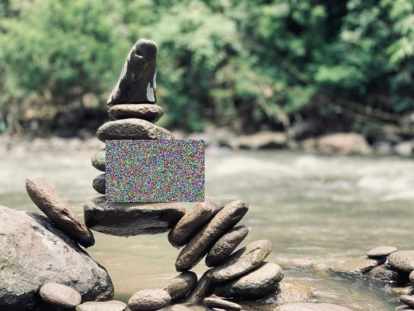
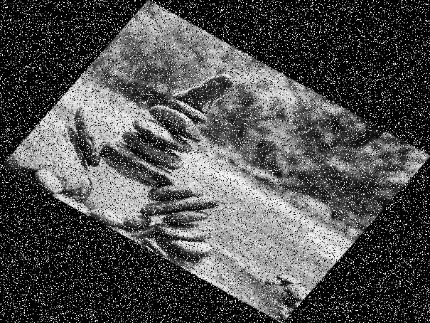

# Annotation Loaders

## FourCornersCSV

Loads annotations from a CSV file in the following format\.

image\_name, x\_min, y\_min, x\_max, y\_max, label

### Parameters

**annotations\_file** *(str)*, required 
The path to the CSV file containing the annotations

**normalized** *(bool)* = True 
whether the bounding box coordinates are stored in a normalized format

## WidthHeightCSV

Loads annotations from a CSV file in the following format\.

image\_name, x\_min, y\_min, width, height, label

### Parameters

**annotations\_file** *(str)*, required 
The path to the CSV file containing the annotations

**normalized** *(bool)* = True 
whether the bounding box coordinates are stored in a normalized format

# Annotation Writers

## FourCornersCSV

Writes annotations to a CSV file in the following format\.

image\_name, x\_min, y\_min, x\_max, y\_max, label

### Parameters

**annotations\_file** *(str)*, required 
The path to the CSV file to write the annotations to

**normalized** *(bool)* = True 
whether the bounding box coordinates should be normalized before saving

## WidthHeightCSV

Writes annotations to a CSV file in the following format\.

image\_name, x\_min, y\_min, width, height, label

### Parameters

**annotations\_file** *(str)*, required 
The path to the CSV file to write the annotations to

**normalized** *(bool)* = True 
whether the bounding box coordinates should be normalized before saving

# Image Loaders

## Directory

Load images from a directory in the filesystem\.

The image name from the AnnotationLoader will be used to fetch a file with
the same name in the given directory\.

### Parameters

**directory** *(str)*, required 
The directory from which to load images

# Image Writers

## Directory

Writes images to a directory in the filesystem\.

Images will be saved to a file with the given name in the given directory\.

### Parameters

**clean\_directory** *(bool)* = True 
whether to forcibly ensure the output directory is empty

**directory** *(str)*, required 
the directory to save images to

# Augmentations

## GaussianNoise

Add gaussian noise to the given image\.

### Example
<table>
<tr>
<td style="vertical-align: bottom">

 
Input Image
</td>
<td style="vertical-align: bottom">

 
Augmented Image
</td>
</tr>
</table>

### Parameters

**mean** *(float)* = 0 

**probs** *(float in range \[0\.0, 1\.0\])* = 1\.0 
The probability that this augmentation will be applied

**variance** *(float)* = 0\.01 

## GrayScale

Return a grayscale version of the given image\.

### Example
<table>
<tr>
<td style="vertical-align: bottom">

 
Input Image
</td>
<td style="vertical-align: bottom">

 
Augmented Image
</td>
</tr>
</table>

### Parameters

**probs** *(float in range \[0\.0, 1\.0\])* = 1\.0 
The probability that this augmentation will be applied

## HorizontalFlip

Horizontally flips the given image\.

### Example
<table>
<tr>
<td style="vertical-align: bottom">

 
Input Image
</td>
<td style="vertical-align: bottom">

 
Augmented Image
</td>
</tr>
</table>

### Parameters

**probs** *(float in range \[0\.0, 1\.0\])* = 1\.0 
The probability that this augmentation will be applied

## RandomEraser

Randomly erase a rectangular area in the given image\.

The erased area is replaced with random noise\.

### Example
<table>
<tr>
<td style="vertical-align: bottom">

 
Input Image
</td>
<td style="vertical-align: bottom">

 
Augmented Image
</td>
</tr>
</table>

### Parameters

**probs** *(float in range \[0\.0, 1\.0\])* = 1\.0 
The probability that this augmentation will be applied

**x\_range** *(range in \[0\.0, 1\.0\])* = \(0\.0, 1\.0\) 
normalized x range for coordinates that may be erased

**y\_range** *(range in \[0\.0, 1\.0\])* = \(0\.0, 1\.0\) 
normalized y range for coordinates that may be erased

## RandomHSV

Randomly shift the color space of the given image\.

### Example
<table>
<tr>
<td style="vertical-align: bottom">

 
Input Image
</td>
<td style="vertical-align: bottom">

 
Augmented Image
</td>
</tr>
</table>

### Parameters

**brightness** *(range in \[\-Inf, Inf\])* = \(0\.0, 0\.0\) 

**hue** *(range in \[\-Inf, Inf\])* = \(0\.0, 0\.0\) 

**probs** *(float in range \[0\.0, 1\.0\])* = 1\.0 
The probability that this augmentation will be applied

**saturation** *(range in \[\-Inf, Inf\])* = \(0\.0, 0\.0\) 

## RandomRotate

Randomly rotate the given image\.

### Example
<table>
<tr>
<td style="vertical-align: bottom">

 
Input Image
</td>
<td style="vertical-align: bottom">

 
Augmented Image
</td>
</tr>
</table>

### Parameters

**angle\_range** *(range in \[\-360\.0, 360\.0\])* = \(\-10\.0, 10\.0\) 
The range from which the random angle will be chosen

**probs** *(float in range \[0\.0, 1\.0\])* = 1\.0 
The probability that this augmentation will be applied

## Rotate

Rotate the given image\.

### Example
<table>
<tr>
<td style="vertical-align: bottom">

 
Input Image
</td>
<td style="vertical-align: bottom">

 
Augmented Image
</td>
</tr>
</table>

### Parameters

**angle** *(float)* = 5 

**probs** *(float in range \[0\.0, 1\.0\])* = 1\.0 
The probability that this augmentation will be applied

## SaltAndPepperNoise

Add salt and pepper or RGB noise to the given image\.

### Example
<table>
<tr>
<td style="vertical-align: bottom">

 
Input Image
</td>
<td style="vertical-align: bottom">

 
Augmented Image
</td>
</tr>
</table>

### Parameters

**noise\_type** *(RGB \| SnP)* = RGB 
The type of noise

**pepper** *(int in range \[0, 255\])* = 0 
The color of the pepper

**probs** *(float in range \[0\.0, 1\.0\])* = 1\.0 
The probability that this augmentation will be applied

**replace\_probs** *(float)* = 0\.1 

**salt** *(int in range \[0, 255\])* = 255 
The color of the salt

## Scale

Scale the given image\.

### Example
<table>
<tr>
<td style="vertical-align: bottom">

 
Input Image
</td>
<td style="vertical-align: bottom">

 
Augmented Image
</td>
</tr>
</table>

### Parameters

**probs** *(float in range \[0\.0, 1\.0\])* = 1\.0 
The probability that this augmentation will be applied

**scale\_x** *(float)* = 0\.2 

* cannot be less than \-1

**scale\_y** *(float)* = 0\.2 

* cannot be less than \-1

## Sequence

Perform a sequence of augmentations on the given image\.

### Example
<table>
<tr>
<td style="vertical-align: bottom">

 
Input Image
</td>
<td style="vertical-align: bottom">

 
Augmented Image
</td>
</tr>
</table>

### Parameters

**augmentations** *(augmentation\_list)* = \[\] 

**probs** *(float in range \[0\.0, 1\.0\])* = 1\.0 
The probability that this augmentation will be applied

## Shear

Horizontally shear the given image\.

### Example
<table>
<tr>
<td style="vertical-align: bottom">

 
Input Image
</td>
<td style="vertical-align: bottom">

 
Augmented Image
</td>
</tr>
</table>

### Parameters

**probs** *(float in range \[0\.0, 1\.0\])* = 1\.0 
The probability that this augmentation will be applied

**shear\_factor** *(float)* = 0\.2 

## Translate

Translate the given image\.

### Example
<table>
<tr>
<td style="vertical-align: bottom">

 
Input Image
</td>
<td style="vertical-align: bottom">

 
Augmented Image
</td>
</tr>
</table>

### Parameters

**probs** *(float in range \[0\.0, 1\.0\])* = 1\.0 
The probability that this augmentation will be applied

**translate\_x** *(float in range \[0\.0, 1\.0\])* = 0\.2 

**translate\_y** *(float in range \[0\.0, 1\.0\])* = 0\.2 

## VerticalFlip

Vertically flip the given image\.

### Example
<table>
<tr>
<td style="vertical-align: bottom">

 
Input Image
</td>
<td style="vertical-align: bottom">

 
Augmented Image
</td>
</tr>
</table>

### Parameters

**probs** *(float in range \[0\.0, 1\.0\])* = 1\.0 
The probability that this augmentation will be applied

